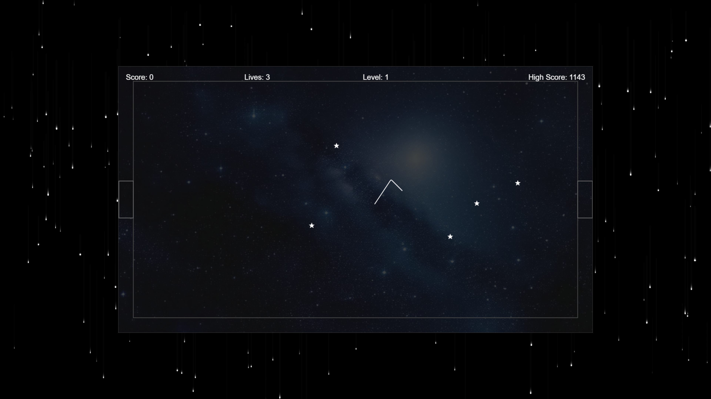
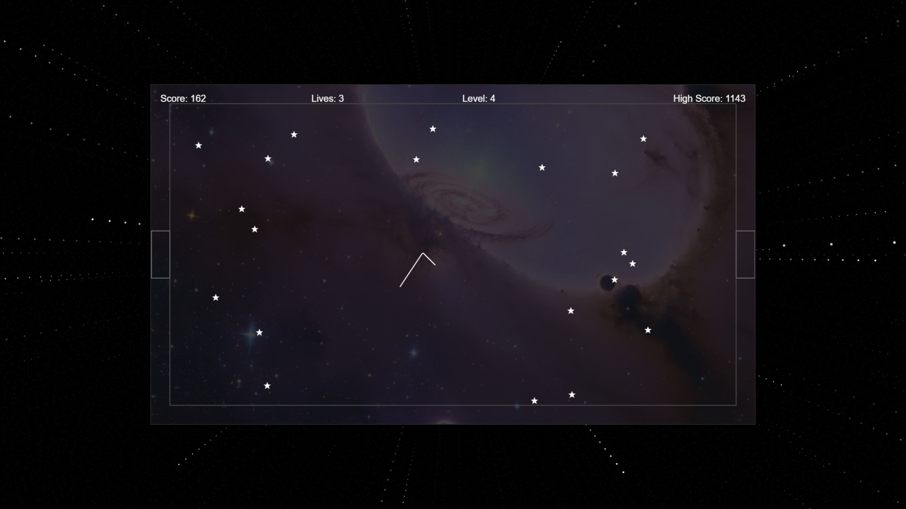

# Star Dodger V2 2024 Remake by p9iaai 2024

A recreation of Star Dodger V2, a BASIC type-in game originally published in Amstrad Action magazine in 1992. Created by Graham French, the original was a masterclass in simple yet addictive gameplay.

Navigate through increasingly challenging levels while avoiding stars and collisions. Just fire up index.html in your browser to play.

*gameplay screen with falling stars effect*

*gameplay screen with warp speed effect*

## 🎮 Gameplay

Navigate your ship through a series of levels, each more challenging than the last. The goal is to reach the exit door on the right side of the screen while:
- Avoiding collisions with walls and stars
- Managing your momentum and trajectory
- Staying focused despite the hypnotic starfield background

### Controls
- **SPACE BAR**: Hold to move up, release to move down
- Ship moves at a constant speed from left to right
- **S KEY**: Toggle between classic falling stars and perspective starfield modes
- **F11**: Toggle fullscreen mode (browser)

### Scoring
- +1 point for each close star passed
- +50 points for completing a level
- Three lives per game
- High scores are saved locally

## 🚀 Features

- Smooth, physics-based movement
- Procedurally generated levels
- Dynamic backgrounds that change with each level
- Dual-mode starfield effects:
  - Classic falling stars (default)
  - Perspective-based "warp speed" effect (toggle with 'S')
- Particle effects and smooth transitions
- High score system
- Responsive 16:9 canvas layout
- Collision detection and response
- Visual feedback for all game events

## 🛠️ Technical Details

### Built With
- Pure JavaScript
- HTML5 Canvas (dual-canvas setup for game and starfield)
- Local Storage for high scores

### Resolution
- 1280x720 (16:9 aspect ratio)
- Responsive scaling
- Full-window animated starfield background

### Performance
- Optimized rendering with layered canvases
- Smooth 60 FPS gameplay
- Efficient collision detection
- Background animation independent of game state

## 🎨 Visual Design

- Minimalist aesthetic
- Dynamic trail effects
- Subtle background imagery with hypnotic starfield
- Clean UI elements
- Smooth transitions between states

## 🏆 High Score Challenge

The current known high score is 1288 which happened during development by me with an utterly minimal and unfocused attempt. Can you beat it while maintaining your focus through the mesmerizing star patterns?

## 💝 Dedication

This game is dedicated to Graham French, who created the original Star Dodger V2 for Amstrad Action magazine in 1992. His creation brought joy to many CPC gamers, including myself, with its elegant simplicity and addictive gameplay.

The original game was described in the magazine as "an absolute corker" where "you have to cross the star field without hitting the meanies and squeeze through a black hole at the far side of the screen." The core mechanic - a ship moving diagonally at tremendous speed with only the space bar to alter its direction - was praised as "fiendishly difficult and very, very addictive."

The fact that these gameplay mechanics remained so clear in memory after 30+ years really speaks to how well-designed the original was. Those type-in listings in magazines like Amstrad Action were often gems of efficient design - they had to be, given the memory constraints and the fact that someone had to physically type them in!

Thank you, Graham French, for creating such a memorable game. This project aims to preserve and celebrate your contribution to 8-bit gaming history.

## 🔄 Game States

1. **Title Screen**
   - Game instructions
   - High score display
   - Press SPACE to start
   - Ambient starfield animation

2. **Playing**
   - Active gameplay
   - Score tracking
   - Lives remaining
   - Current level
   - Dynamic background effects

3. **Game Over**
   - Final score display
   - High score update
   - Press SPACE to restart
   - Continuous starfield animation

## 🎯 Tips for High Scores

1. Plan your route through the stars
2. Stay close to stars without touching them for extra points
3. Time your up/down movements carefully
4. Watch for patterns in star placement
5. Don't rush - steady progress is key
6. Try not to get hypnotized by the background! (Switch modes with 'S' if one is too mesmerizing)

## 🔜 Potential Future Features That Almost Certainly Will Never Happen

- Multiple difficulty modes
- Additional visual effects
- Sound effects and music
- Global high score board
- Achievement system
- Even more starfield patterns
- VR support (just kidding!)
